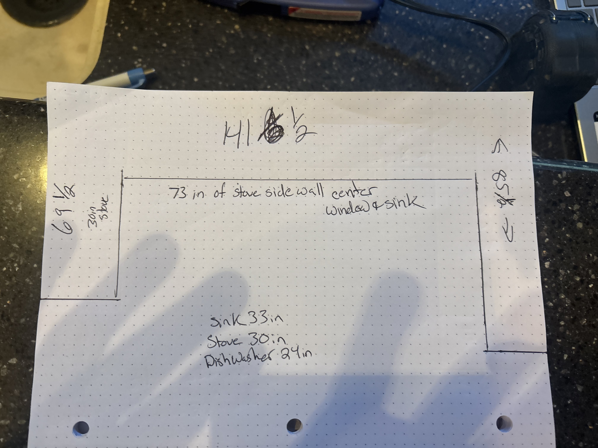

Red- black and https://pastatic.picsart.com/81235935799535220126.png?type=webp&to=min&r=400&q=95
## 👋 About Me
Hey there — I’m Augie. I like building things that actually *work* (preferably better than they did before).  
Right now, I’m learning GitHub to document real projects — not just code, but hands-on work like remodels, repairs, and creative builds.  
If it involves tools, problem-solving, or caffeine, I’m in.

Learning get hub
step 1 complete#

# 🧰 My First Repository

## 🏗️ Project: Kitchen Remodel

Learning GitHub, one sawdust-covered step at a time.  
This project documents the process of remodeling my kitchen—cabinet installs, plumbing relocation, and all the chaos in between.

---

### 🔧 Step 1: Planning & Demo
- Removed 21 feet of old cabinets  
- Prepped for 34 feet of new floor cabinets  
- Moved sink plumbing across the room  
- Installed new sink and dishwasher  

---

### 📸 Progress Photos

---

### 💬 Notes
> “Measure twice, cut once. And then measure again anyway.”

---

### 🧠 Lessons Learned
- GitHub isn’t just for code—it’s perfect for tracking home projects.  
- Commit messages are your digital diary.  
- Patience (and a level) are mandatory.

---
# 🧰 Augie’s Project Portfolio
## Featured Projects
- [Kitchen Remodel](https://github.com/yourusername/Kitchen-Remodel)
- [Office Renovation](https://github.com/yourusername/Office-Renovation)
- [Retail Counter Buildout](https://github.com/yourusername/Retail-Counter)
### ✅ Status
**Step 1 complete.**  
Next up: lighting and backsplash.

